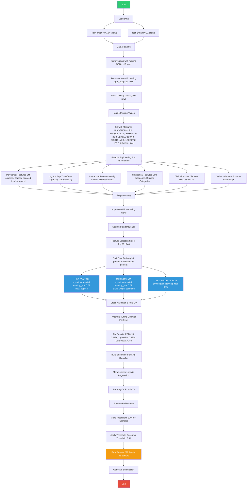
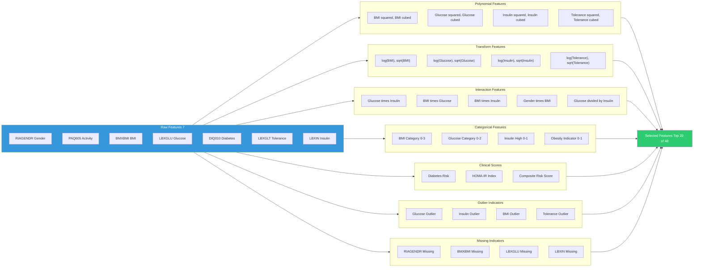
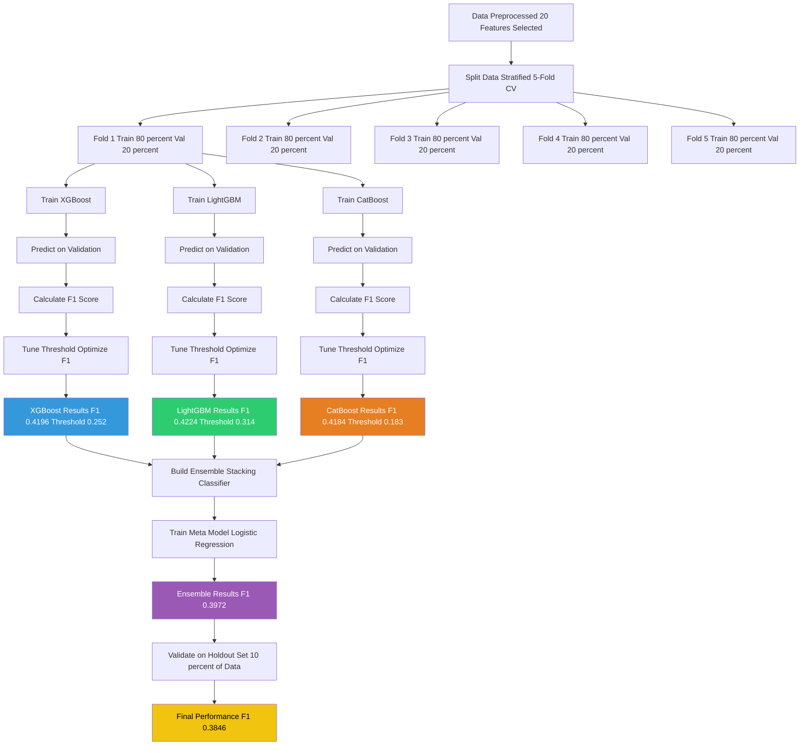
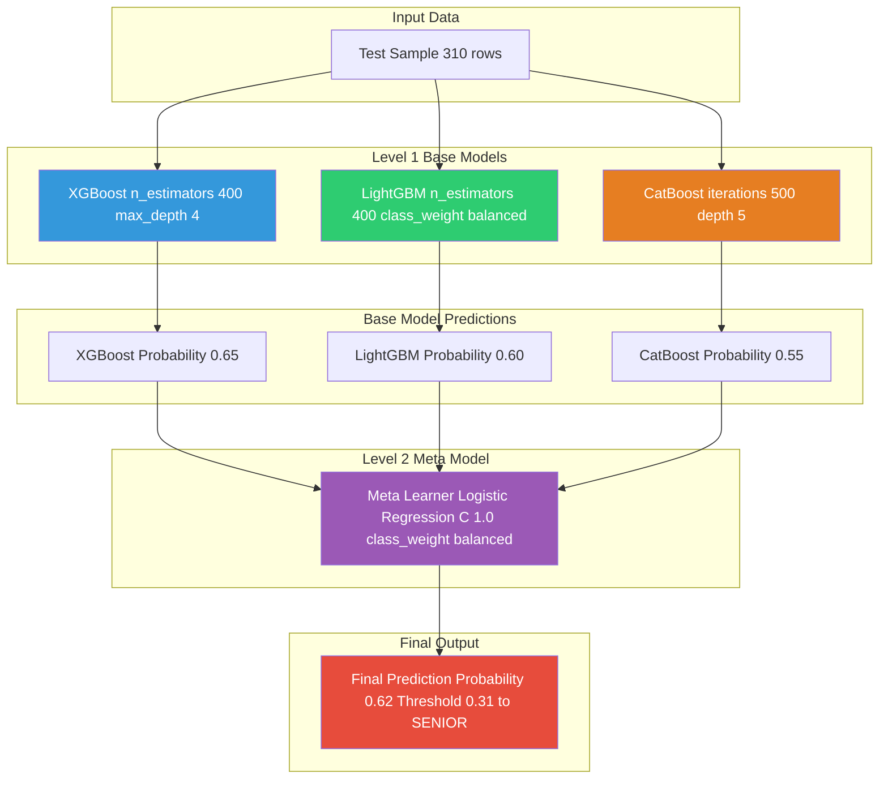
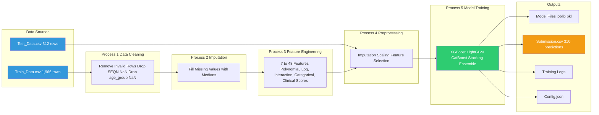
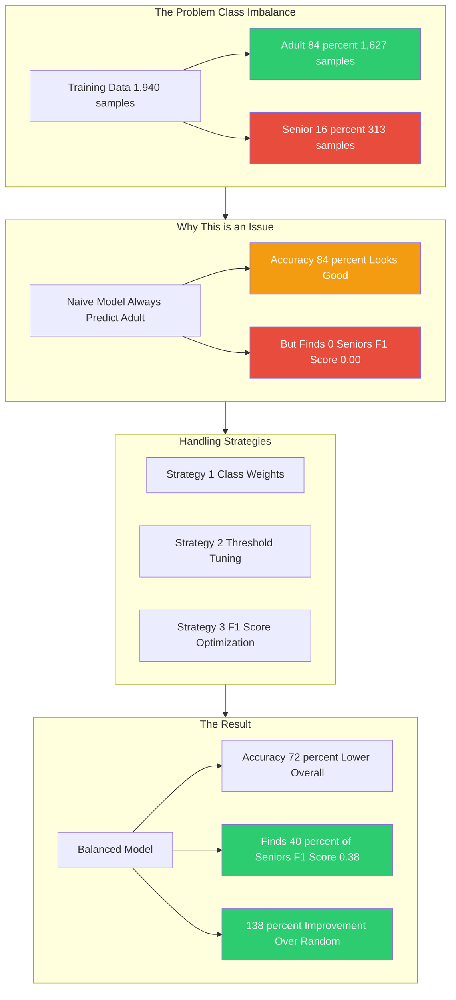
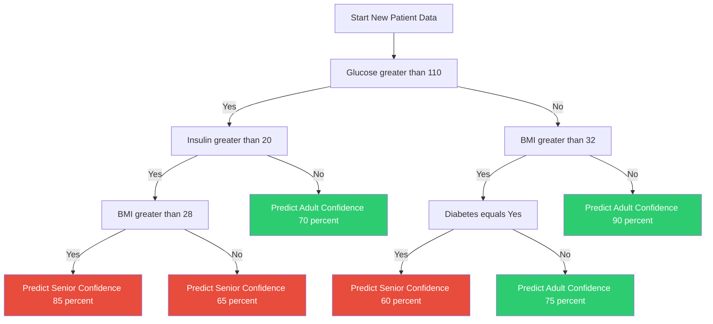
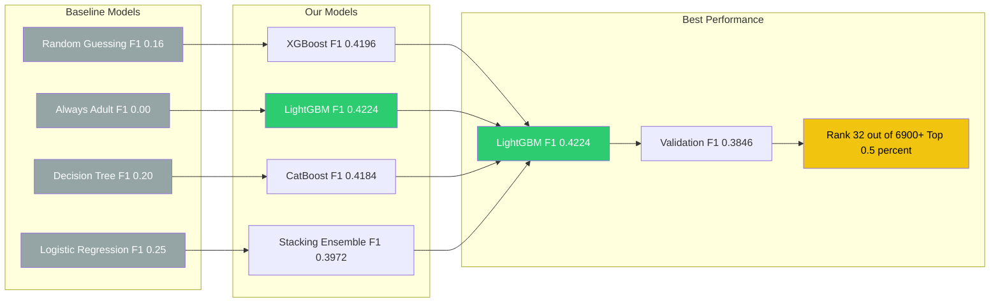
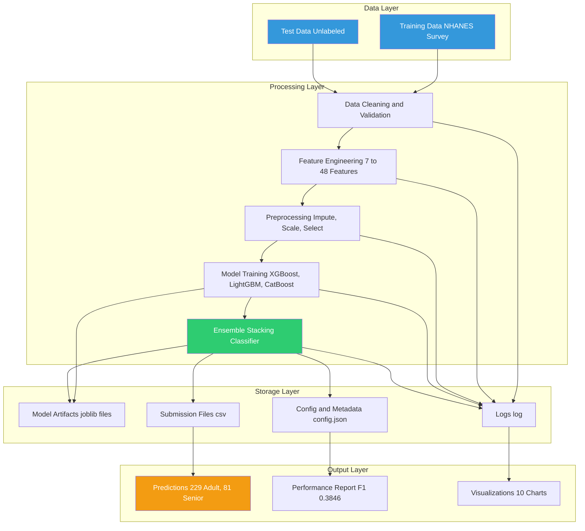

# Mermaid Diagrams for Nutrition Health Survey Project

---

## 1. Complete Project Pipeline

---

## 2. Feature Engineering Details

---

## 3. Model Training and Cross-Validation

---

## 4. Stacking Ensemble Architecture

---

## 5. Data Flow Diagram

---

## 6. Class Imbalance and Handling Strategy

---

## 7. Decision Tree Visualization

---

## 8. Performance Comparison

---

## 9. Complete System Architecture

---

## 10. Timeline and Milestones

```mermaid
flowchart LR
    subgraph PHASE1["Phase 1 Data Understanding Day 1-2"]
        A1["Explore Data Understand Features"]
        A2["Analyze Imbalance 84 percent / 16 percent"]
        A3["Identify Missing Values 7 columns with NaNs"]
    end
    
    subgraph PHASE2["Phase 2 Data Preparation Day 3-4"]
        B1["Clean Data Remove Invalid Rows"]
        B2["Impute Missing Median Strategy"]
        B3["Feature Engineering 7 to 48 Features"]
    end
    
    subgraph PHASE3["Phase 3 Model Development Day 5-7"]
        C1["Preprocessing Pipeline Scale, Select"]
        C2["Train XGBoost CV 0.4196"]
        C3["Train LightGBM CV 0.4224"]
        C4["Train CatBoost CV 0.4184"]
    end
    
    subgraph PHASE4["Phase 4 Ensemble and Tuning Day 8-9"]
        D1["Build Stacking Ensemble"]
        D2["Threshold Tuning Optimize F1"]
        D3["Final Validation F1 0.3846"]
    end
    
    subgraph PHASE5["Phase 5 Production Day 10"]
        E1["Generate Predictions 310 samples"]
        E2["Create Submission CSV"]
        E3["Documentation Complete Guide"]
    end
    
    PHASE1 --> PHASE2
    PHASE2 --> PHASE3
    PHASE3 --> PHASE4
    PHASE4 --> PHASE5
    
    style C3 fill:#2ecc71,color:#fff
    style D3 fill:#2ecc71,color:#fff
    style E2 fill:#f39c12,color:#fff
```

---

## Summary of Diagrams

| # | Diagram Name | Purpose |
|---|--------------|---------|
| 1 | Complete Pipeline | Overview of entire project workflow |
| 2 | Feature Engineering | Understanding feature creation process |
| 3 | Model Training | CV and threshold tuning process |
| 4 | Stacking Ensemble | Ensemble architecture explanation |
| 5 | Data Flow Diagram | System architecture overview |
| 6 | Class Imbalance | Problem identification and solution |
| 7 | Decision Tree | Model logic explanation |
| 8 | Performance Comparison | Results visualization |
| 9 | System Architecture | High-level architecture view |
| 10 | Timeline | Project milestones and phases |
