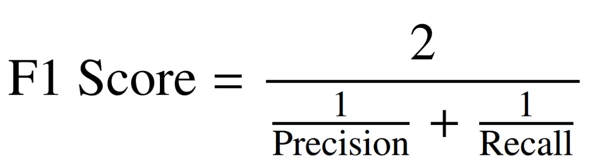

# 🧠 Nutrition Health Survey – Age Prediction  
### Summer Analytics 2025 – IIT Guwahati  
*Organized by the Consulting and Analytics Club, IIT Guwahati*

---

## 📋 Overview

This challenge is built around a subset of the **National Health and Nutrition Examination Survey (NHANES)** — a nationwide study conducted by the **CDC's National Center for Health Statistics**. NHANES uniquely combines **interviews, physical examinations, and lab tests** to evaluate the health and nutrition of people in the U.S.

In this challenge, you're provided with a focused dataset of **6,287 entries and 7 key features**. Your task is to develop a machine learning model that predicts whether a person is a **Senior (65+ years old)** or an **Adult (under 65 years)** based on health-related metrics.

This competition is part of **Summer Analytics 2025**, in collaboration with the **Consulting and Analytics Club, IIT Guwahati**.

---

## 🧠 Problem Statement

Build a **binary classification model** that predicts the `age_group` of a person based on various health indicators.

- **Label 0** → Adult (under 65)
- **Label 1** → Senior (65 and above)

---

## 📁 Files Provided

You are provided with three CSV files:

| File                   | Description                                                                 |
|------------------------|-----------------------------------------------------------------------------|
| `Train_Data.csv`       | 2,016 rows with 7 features and the target column `age_group`                |
| `Test_Data.csv`        | 312 rows with 7 features but **no target column**                           |
| `Sample_Submission.csv`| Format example for your submission; includes columns `SEQN`, `age_group`    |

> 📝 Use the training data to build and validate your model. Then use the test data for predictions.

---

## 🔍 Features Description

| Column     | Description                                                                 |
|------------|-----------------------------------------------------------------------------|
| `SEQN`     | Unique identifier for each respondent                                       |
| `RIAGENDR` | Gender (1 = Male, 2 = Female)                                                |
| `PAQ605`   | Physical activity response (moderate/vigorous activity in a typical week)   |
| `BMXBMI`   | Body Mass Index                                                             |
| `LBXGLU`   | Glucose Level                                                                |
| `DIQ010`   | Diabetes questionnaire response                                              |
| `LBXGLT`   | Oral Glucose Tolerance                                                      |
| `LBXIN`    | Insulin Level                                                               |

> ⚠️ **Missing values (`NaN`) may be present** in the dataset. Handle them appropriately during preprocessing.

---

## 🎯 Target Variable – `age_group`

This is the variable you need to predict in `Test_Data.csv`.

| Label | Meaning             |
|-------|---------------------|
| `0`   | Adult (under 65)    |
| `1`   | Senior (65 and above) |

✅ Only values `0` or `1` are allowed in your final predictions.

---

## 🧪 Evaluation Metric – F1 Score

Your model will be evaluated based on the **F1 Score**, which is the harmonic mean of **Precision** and **Recall**. It’s ideal for imbalanced classification problems.

### F1 Score Formula:



Where:

- **TP** = True Positives  
- **FP** = False Positives  
- **TN** = True Negatives  
- **FN** = False Negatives  

**Precision** = TP / (TP + FP)  
**Recall** = TP / (TP + FN)

> 📘 [Learn More About F1 Score](https://en.wikipedia.org/wiki/F1_score)

---

## ⚙️ How the Challenge Works

1. **Training Phase**:  
   Use `Train_Data.csv` with features and `age_group` labels to train your classification model.

2. **Testing Phase**:  
   Predict `age_group` values for entries in `Test_Data.csv`.

3. **Submission**:  
   Your output should match the format in `Sample_Submission.csv`, with:

   ```
   SEQN,age_group
   12345,0
   67890,1
   ...
   ```

4. **Leaderboard Evaluation**:
   - **Public Leaderboard**: Based on ~50% of test set.
   - **Private Leaderboard**: Final ranking based on the remaining 50%.

5. **Tie-Breaker Rule**:  
   In case of a tie, top-5 participants will be evaluated based on their **Feature Engineering** and **Exploratory Data Analysis (EDA)** quality.

6. **Mark as Final**:  
   🔒 You must **mark your submission as FINAL** to be eligible for the **Private Leaderboard**.

---

## ✅ Submission Checklist

- [ ] Train your model using `Train_Data.csv`
- [ ] Predict `age_group` for each entry in `Test_Data.csv`
- [ ] Format the submission to include only `SEQN` and `age_group`
- [ ] Ensure values in `age_group` are only `0` or `1`
- [ ] Upload your CSV and **mark it as FINAL** for private evaluation

---

## 🧼 Data Notes & Best Practices

- Handle missing data (`NaN`) through imputation or removal
- Consider feature scaling (especially for glucose and insulin values)
- Explore relationships using EDA (scatter plots, histograms, correlations)
- Test different classification models (e.g., Logistic Regression, Random Forest, XGBoost)
- Cross-validate for better generalization

---

## 📝 Disclaimer

This dataset is a simplified and preprocessed version of NHANES data from the CDC. It is provided strictly for **educational purposes**. We do not claim ownership of the original dataset.

---

## 👨‍💻 Maintainers

Challenge hosted by:  
**Consulting and Analytics Club**  
**Indian Institute of Technology (IIT) Guwahati**

---

## 📚 References

- NHANES Official Website: [https://www.cdc.gov/nchs/nhanes](https://www.cdc.gov/nchs/nhanes)
- F1 Score (Wikipedia): [https://en.wikipedia.org/wiki/F1_score)

---

## 📌 License

This project is intended for **educational use only**. Please refer to the original NHANES dataset license for data usage terms.
